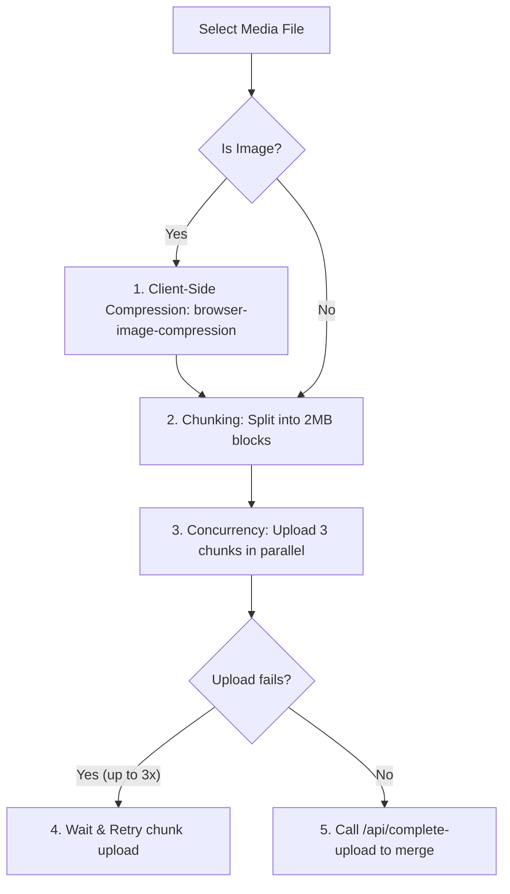
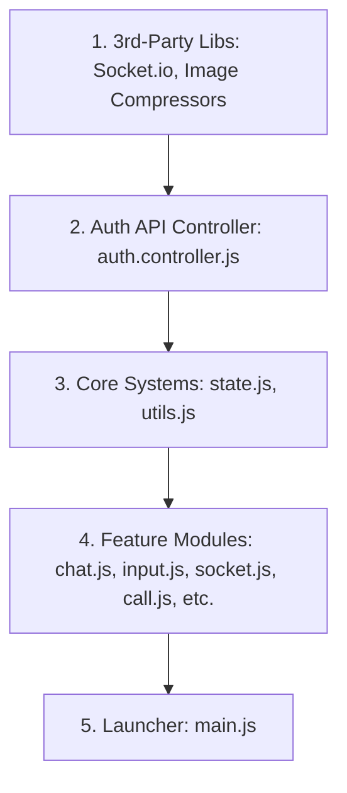

# Public Folder (`/public`)

This folder contains the static assets served directly to the client browser, including styling sheets, client-side modules, audio cues, and page assets.

Below is a detailed guide on how the client-side JavaScript architecture works and what role each module plays.

---

## ⚡ Media Upload Optimization (Speed & Reliability)

InstaChat features a robust media processing pipeline designed to handle large attachments (images, videos, audio, and documents) rapidly and reliably over any connection.

### 1. 🖼️ Client-Side Image Compression
* **How it works**: When a user selects or paste-shares an image, the application runs **[`browser-image-compression`](https://www.npmjs.com/package/browser-image-compression)**.
* **Why it increases speed**: 
  * It processes the image inside a background thread (**Web Workers**) so the main browser window never freezes.
  * It reduces image sizes to a maximum of **1MB** and constrains dimensions to **1280px** width/height.
  * An image taken on a phone is compressed from 5MB–10MB down to under 500KB before upload, representing a **10x upload speed increase** on slower mobile networks.

### 2. 🧱 Parallel Chunked Uploads
* **How it works**: For larger files (such as long voice memos, videos, or PDFs), sending the entire file in one HTTP request can lead to timeout failures. 
* **Optimized Parameters**:
  * **`CHUNK_SIZE = 2 * 1024 * 1024` (2MB)**: Files are sliced into 2MB blocks.
  * **`PARALLEL = 3`**: The client uploads **3 chunks concurrently** to maximize bandwidth consumption.
* **Why it increases speed**: Concurrent uploading allows the browser to utilize multiple TCP streams, transferring data faster than single-threaded uploads.

### 3. 🔄 Robust Retry Logic & Backoff
* **How it works**: If a chunk fails to upload (due to cell network drops or temporary server issues), the application does not restart the entire upload.
* **Details**:
  * It retries uploading that specific chunk up to **3 times**.
  * It implements a **sleep delay** between retries (`retries * 1000ms`) to allow the network connection to recover.
  * If a connection drop lasts longer, the upload status is set to `failed` and queued in the `UploadQueue` to be retried once connectivity returns.
  * It uses an **`AbortController`** to enforce request timeouts (60 seconds for documents/audio, 180 seconds for videos) to prevent requests from hanging indefinitely.

---

## 🏗️ Front-End Architecture: How the JavaScript Works

The front-end is designed as a modular **Single Page Application (SPA)** written in vanilla JavaScript. 

Instead of reloading the browser window when navigating between screens (e.g. going from the decoy dashboard to login, or login to chat), JavaScript dynamically swaps HTML contents and triggers layout classes.

### 🔌 Dependency Chain & Load Order
Since we are using standard browser scripts rather than an ES module bundler, files must load in a precise sequence. A file cannot utilize helper functions or state variables unless the script defining them has loaded *first*.

To see this load sequence in the HTML structure, refer to [`views/index.ejs`](file:///d:/Buzz/Buzz/views/index.ejs#L1078-L1102).

---

## 📁 JavaScript Files Guide (`/public/js`)

Here is an easy-to-understand breakdown of what each client-side script does:

### 1. 📂 Core & State Management

#### 📝 [state.js](file:///d:/Buzz/Buzz/public/js/state.js)
* **What it does**: Holds the global memory (state) of the active application.
* **Key Functions & Objects**:
  * `State`: Global object tracking `currentUser`, `activeChatId`, `activeRoomId`, `friendsList`, and `messagesCache`.
  * `OutboxQueue` / `UploadManager`: Manages queued text messages and file uploads to ensure they retry or upload successfully if the network blips.
  * `NetworkMonitor`: Keeps track of internet connectivity to display "Offline" banners when connection drops.

#### 📝 [utils.js](file:///d:/Buzz/Buzz/public/js/utils.js)
* **What it does**: Contains simple, reusable helper functions that do not affect the HTML structure directly.
* **Key Functions**:
  * `formatTime(date)`: Converts timestamps to readable human times (e.g., `10:30 PM`).
  * `sanitizeInput(text)`: Scrubs HTML characters from inputs to prevent script injection attacks.
  * `showToast(message, type)`: Generates animated toast alert overlays (e.g., Green for success, Red for errors).
  * `makeLinksClickable(text)`: Finds web URLs in chat messages and converts them to clickable `<a>` links.

---

### 2. 🔑 Authentication Layer

#### 📝 [auth.controller.js](file:///d:/Buzz/Buzz/public/js/auth.controller.js)
* **What it does**: Houses the raw `fetch` requests communicating with the backend `/auth` routes.
* **Key Functions**:
  * `loginUser(identifier, password)`: Passes login details and retrieves JWT tokens.
  * `createUser(username, email, password)`: Handles registration.
  * `allUser()`: Queries lists of users in the system.

#### 📝 [auth.js](file:///d:/Buzz/Buzz/public/js/auth.js)
* **What it does**: Handles the UI visual transitions for the login/signup overlays and profile customization screens.
* **Key Functions**:
  * `initAuth()`: Binds event listeners to login and signup buttons.
  * `bootstrapAfterLogin(token, user)`: Sets up user state, starts WebSockets, and swaps the authentication layouts to reveal the chat window.
  * `renderProfileModal()`: Loads the profile configuration window where users toggle notifications or customize their avatars.

---

### 3. 💬 Messaging & Interface

#### 📝 [chat.js](file:///d:/Buzz/Buzz/public/js/chat.js)
* **What it does**: Renders conversation bubbles, list items in the sidebar, and processes text-message delivery.
* **Key Functions**:
  * `openChat(friendId)`: Loads the conversation history, marks incoming messages as read, and opens the chat feed window.
  * `createMessageElement(msg)`: Dynamically generates the HTML bubble structure for a message, applying correct classes depending on whether it was sent or received.
  * `renderMessages(messages)`: Iterates and displays message bubbles in the active window.

#### 📝 [messages.dom.js](file:///d:/Buzz/Buzz/public/js/messages.dom.js)
* **What it does**: Allows fast updates to specific message bubbles that are already displayed on the screen.
* **Key Functions**:
  * `updateMessageByTempId(tempId, updates)`: Replaces a temporary message placeholder with real DB contents after the server confirms it was saved.
  * `updateMediaDOM()` / `updateAudioDOM()`: Swaps loading spinners with the actual uploaded media/voice note waveforms.

#### 📝 [input.js](file:///d:/Buzz/Buzz/public/js/input.js)
* **What it does**: Monitors user actions in the input panel (typing text, record buttons, selecting files).
* **Key Functions**:
  * `initChatWindow()`: Binds click events to file selector icons, emojis, and voice recording buttons.
  * `handleFiles(files)`: Compresses selected images and initiates chunked uploads.
  * `startVoiceRecording()` / `stopVoiceRecording()`: Accesses user mic and records audio.

---

### 4. 📳 Real-Time Network (WebSockets & Media)

#### 📝 [socket.js](file:///d:/Buzz/Buzz/public/js/socket.js)
* **What it does**: Manages the Socket.io client layer, sending and listening to real-time events.
* **Key Functions**:
  * `initSocket(token)`: Connects client sockets to the server.
  * Bindings for `private_message`, `message:delivered`, `typing:start`, `user:online`, and others to update the visual UI immediately when another user acts.

#### 📝 [call.js](file:///d:/Buzz/Buzz/public/js/call.js)
* **What it does**: Manages WebRTC media streams, signaling, and call overlays for video and voice calls.
* **Key Functions**:
  * `startCall(type)`: Requests local camera/mic access and triggers the call offer process.
  * `handleSignalingData(data)`: Exchanges SDP descriptions and network ICE candidates.
  * `endCall()`: Closes WebRTC connections and hides calling panels.

#### 📝 [voice.stream.js](file:///d:/Buzz/Buzz/public/js/voice.stream.js)
* **What it does**: Handles "Live Voice" broadcasts where one user streams live audio to another like a walkie-talkie.
* **Key Functions**:
  * `startVoiceStream()`: Records micro-chunks of audio and sends them over `voice:chunk` socket event.
  * `playVoiceChunk(samples)`: Plays raw PCM audio buffers received in real-time.

---

### 5. 🎨 UI Widgets & Overlays

#### 📝 [ui.extras.js](file:///d:/Buzz/Buzz/public/js/ui.extras.js)
* **What it does**: Implements accessibility controls, secret trigger listeners, password prompts, and carousels.
* **Key Functions**:
  * **Emblem Click Listener**: Listens to clicks on `#secretButton`. If 5 clicks occur within 1 second, it triggers the transition from the decoy dashboard to the chat layout.
  * `showMediaGallery(items)`: Renders full-screen media galleries.
  * **Carousel Autoplay**: Toggles the banner slide intervals on the decoy portal.

#### 📝 [camera.capture.js](file:///d:/Buzz/Buzz/public/js/camera.capture.js)
* **What it does**: Captures instant photos using the user's camera.
* **Key Functions**:
  * `captureInstantMoment()`: Grabs a frame from the webcam feed, converts it to a base64 JPEG, and uploads it as a moment snapshot.

#### 📝 [emoji.panel.js](file:///d:/Buzz/Buzz/public/js/emoji.panel.js)
* **What it does**: Powers the pop-up emoji panel for typing emojis or reacting to messages.

#### 📝 [media.viewer.js](file:///d:/Buzz/Buzz/public/js/media.viewer.js)
* **What it does**: Controls the carousel slides inside the full-screen media viewer overlay (`#mediaViewer`).

#### 📝 [audio.player.js](file:///d:/Buzz/Buzz/public/js/audio.player.js)
* **What it does**: Initializes and manages custom playback waveform HTML elements for recorded voice notes.
