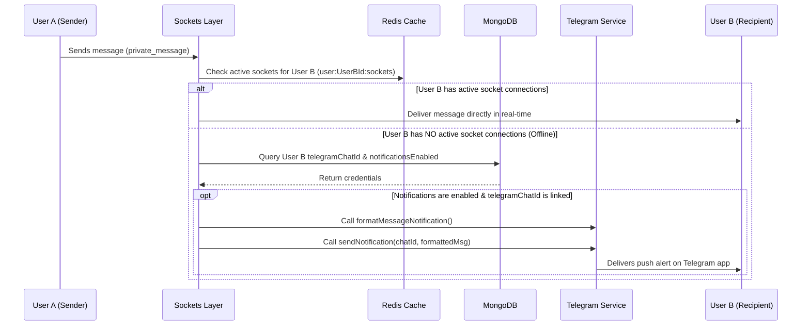

# Services Folder (`/services`)

This folder manages integrations with third-party APIs and external platforms. 

The primary service implemented is **[`telegram.service.js`](file:///d:/Buzz/Buzz/services/telegram.service.js)**, which forwards chat notification digests directly to users on Telegram when they are offline.

---

## 🤖 Telegram Notification Integration

This service utilizes the **`node-telegram-bot-api`** library. It initializes a Telegram Bot client in *webhook/non-polling* mode (`polling: false`) since it only sends outbound messages and does not need to listen to incoming commands on this thread.

### 📋 Setup Workflow: How to Link a Bot

To utilize the Telegram notifications feature, a developer or administrator must perform the following configuration steps:

1. **Create a Telegram Bot**:
   * Open Telegram and search for **@BotFather**.
   * Send the command `/newbot` and follow the prompts to name the bot and choose a username.
   * BotFather will generate an API Access Token (e.g., `123456789:ABCdefGhIJKlmNoPQRsTUVwxyZ`).

2. **Configure Environment Variables**:
   * Add the token to the project's `.env` file:
     ```env
     TELEGRAM_BOT_TOKEN=your_generated_bot_token_here
     ```

3. **Get User Chat ID**:
   * Users need to interact with the bot (e.g. click "Start" or send a message) to authorize the bot to contact them.
   * The user's Telegram Chat ID (`telegramChatId`) must be linked to their user account in MongoDB (handled by the `/auth/telegram/link` API endpoint in `auth.controller.js`).

---

## ⚙️ Service API Reference

The service exports a `telegramService` object containing the following methods:

### 1. `sendNotification(telegramChatId, message)`
* **Description**: Delivers a formatted message to the user's Telegram account.
* **Arguments**:
  * `telegramChatId` (String/Number): The recipient's Telegram chat identifier.
  * `message` (String): The text payload (supports basic HTML tags).
* **Options**: Passes `{ parse_mode: 'HTML' }` so the text can use styling formatting (such as `<b>` or `<i>`).
* **Returns**: `true` on successful transmission, `false` on failure.

### 2. `formatMessageNotification(senderName, messageType, preview)`
* **Description**: Compiles a user-friendly notification layout based on the content type.
* **Arguments**:
  * `senderName` (String): The username of the sender.
  * `messageType` (String): The category of message (`text`, `image`, `video`, `audio`, `file`, etc.).
  * `preview` (String): A short preview snippet (truncated text content or caption).
* **Mapping Icons**:
  * 💬 `text` (default)
  * 📷 `image`
  * 🎥 `video`
  * 🎵 `audio`
  * 📎 `file`
* **Output Format**:
  ```html
  <Icon> <b>New message from <senderName></b>

  <preview>
  ```

---

## 🔄 Dynamic Lifecycle Flow

Here is how the system determines when and how to call the service:


