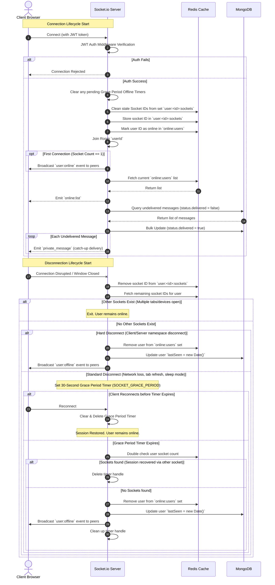

# Socket Connection, Disconnection, and Online Tracking Flow

This document details the lifecycle of a real-time Socket.io connection on the Buzz platform, covering authentication, session recovery, online status tracking, and the custom 30-second disconnection grace period.

---

## High-Level Architecture Diagram

---

## 1. Connection Flow Details

### Phase A: JWT Authentication
1. Every new connection request passes through the **Global Socket Authentication Middleware** (`socketAuth`).
2. The server verifies the client's JSON Web Token (JWT).
3. Upon success, the user object is decrypted and attached directly to the connection object as `socket.user = { id, username, avatar }`.

### Phase B: Online State Tracking
1. **Timer Cancellation**: The server checks the in-memory `disconnectTimers` map. If a pending grace period offline timer exists for this `userId`, it is cancelled (`clearTimeout`) and removed from the map.
2. **Stale ID Pruning**: The server queries the Redis set `user:<userId>:sockets` and cross-references all registered IDs with active namespace connections, removing any stale IDs.
3. **Redis Registry**:
   * The current connection's `socket.id` is added to the Redis set `user:<userId>:sockets`.
   * The `userId` is added to the global online registry set `online:users`.
   * The socket joins the user's private channel (`socket.join(userId)`).
4. **Peer Broadcasting**: If the active connection count in `user:<userId>:sockets` is exactly `1` (representing the user's first connection / device online), the server broadcasts a `user:online` event to all other clients.
5. **Initial State Fetch**: The server fetches the current list of online users from Redis (`online:users`) and emits an `online:list` payload to the connecting socket.

### Phase C: Message Recovery
1. The server checks the MongoDB `messages` collection for any pending messages addressed to `userId` that have not yet been marked as delivered (`status.delivered = false`).
2. If pending items exist:
   * It performs a bulk update setting `status.delivered = true` and `deliveredAt = new Date()`.
   * It loops and delivers each missed message sequentially over the active socket session (`private_message`).

---

## 2. Disconnection Flow Details

### Phase A: Device Status Evaluation
1. The client socket disconnects (due to a window close, tab refresh, sleep mode, or network disruption).
2. The socket ID is immediately removed from the user's Redis socket registry: `redis.srem("user:<userId>:sockets", socket.id)`.
3. The server retrieves all remaining registered socket IDs for the user in Redis:
   * If any other socket remains active in the namespace (e.g. the user has another tab or device open), the server stops processing. The user's status remains online.
   * If no other active sockets remain, the server proceeds to status transition.

### Phase B: Grace Period (Blip Protection)
To avoid triggering constant online/offline status updates during rapid page transitions (refreshes), network switching, or short mobile sleep states:
1. **Hard Disconnects**: If the socket reports the disconnect reason as a deliberate action (`server namespace disconnect` or `client namespace disconnect`), the grace period is skipped. The user is marked offline immediately.
2. **Standard Disconnects**:
   * The server initializes a timeout callback based on `SOCKET_GRACE_PERIOD` (default is **30,000ms / 30 seconds**).
   * The timer handle is stored in the `disconnectTimers` map against `userId`.
   * If the user reconnects within this 30-second window, the connection flow clears this timer, preserving the user's online state.

### Phase C: Offline Status Execution
If the grace period timer expires:
1. The timeout checks the Redis set `user:<userId>:sockets` one final time to verify no new connection was established.
2. If still disconnected:
   * The user ID is removed from the Redis `online:users` set.
   * The server broadcasts a `user:offline` notification to all other clients: `socket.nsp.emit("user:offline", { userId })`.
   * The user's database entry is updated with the current timestamp: `User.findByIdAndUpdate(userId, { lastSeen: new Date() })`.
   * The timer handle is cleaned up from the map.
