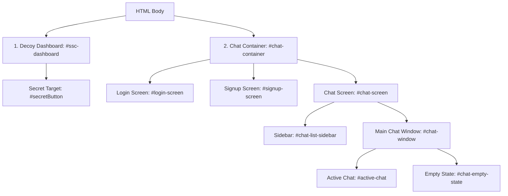

# Views Folder (`/views`)

This folder contains page templates rendered server-side by the Express application. 

The primary entry point of this application is **[`index.ejs`](file:///d:/Buzz/Buzz/views/index.ejs)**, which serves as a Single Page Application (SPA). To help beginners understand how this file, HTML, and EJS work together, we have prepared a detailed guide below.

---

## 💡 Beginner's Guide: Understanding EJS & HTML

### 1. What is HTML?
**HTML** (HyperText Markup Language) is the standard skeleton of a webpage. It uses tags enclosed in angle brackets (`<tagname>`) to define structure:
* **Elements:** A combination of a start tag, content, and an end tag (e.g., `<h1>My Heading</h1>`).
* **Attributes:** Key-value pairs inside the start tag that configure the element or provide information (e.g., `<div id="my-id" class="my-class">`).
  * `id`: A unique identifier for a specific element (used to target with CSS or JavaScript).
  * `class`: A identifier that can be shared among multiple elements to apply common styles.
  * `src`: Defines the source URL of an image or script (e.g. ``).
* **Nesting:** HTML elements can contain other elements. For example, a list container `<ul>` contains item tags `<li>`.

### 2. What is EJS?
**EJS** (Embedded JavaScript) is a template engine that allows Node.js to write dynamic data into an HTML page before sending it to the user's browser.
* Inside EJS, you can use server-side tags:
  * `<%= data %>` outputs the value of a JavaScript variable directly into the HTML.
  * `<% if (condition) { %> ... <% } %>` executes JavaScript logic like conditions or loops to dynamically show/hide parts of the page.
* In `index.ejs`, since all routing happens on the client side, EJS serves as a single template container wrapping static mock elements and modular scripts.

---

## 🔍 Detailed Walkthrough of `index.ejs`

The `index.ejs` file is divided into two primary root containers inside the HTML body: the **Decoy Dashboard** and the **Secret Chat Application**.



### 1. Document Head & Metadata (Lines 1–25)
* Declares `<!DOCTYPE html>` to tell the browser this is an HTML5 document.
* Wraps the header in the `<head>` tag, loading fonts (Outfit, Inter) and style sheets (FontAwesome, Custom Styles).
* Configures mobile support, preventing automatic scaling and telephone link detection so it feels like a native mobile app.

### 2. Decoy Container: `#ssc-dashboard` (Lines 27–284)
This section is visible immediately when a user visits the webpage. It mimics the **Staff Selection Commission of India** portal.
* **Header & Emblem:** Inside the header, there is a small element:
  ```html
  <div class="emblem" id="secretButton" title="Triple-click for secret access">
      
  </div>
  ```
  * *HTML Lesson:* The `img` tag displays the Indian Flag icon. The parent `div` has `id="secretButton"`. Although the title tag mentions "Triple-click", the actual client-side JavaScript (`ui.extras.js`) listens for **5 clicks in quick succession** to open the real app.
* **Decoy Widgets:** Contains navigation links, slides (`.carousel`), latest news banners (`<marquee>`), and list items explaining exam schedules to complete the illusion.

### 3. Chat Application Container: `#chat-container` (Lines 286–1076)
This container is styled with `display: none` by default. When the secret button is clicked 5 times, JavaScript toggles a `.hidden` class on the decoy and `.active` on this container to show it.

* **Media Viewer Carousel (`#mediaViewer`):**
  * An overlay window used to display images/videos when a user clicks shared media files in chat, supporting left/right slider controls.
* **Authentication Screens:**
  * **Login Screen (`#login-screen`):** Form containing input elements for username and password (`#login-username`, `#login-password`) and submit buttons.
  * **Signup Screen (`#signup-screen`):** Form containing inputs for username, email, password, and confirmation password.
* **Main Chat Interface (`#chat-screen`):**
  * **Sidebar (`#chat-list-sidebar`):** Renders the user's avatar, active search input (`#chat-search`), and the chat list area (`#chat-list`) where individual conversations appear.
  * **Chat Window (`#chat-window`):**
    * When no conversation is selected, it displays `#chat-empty-state`.
    * When a chat is open, it switches to `#active-chat` which renders:
      * **Header:** Displays the recipient's username (`#chat-username`), online status indicator (`#online-status`), and call option triggers (`#audio-call-btn`, `#video-call-btn`).
      * **Message Feed (`.messages-container`):** Holds individual message bubbles.
      * **Input Bar (`.chat-input-area`):** Input box for typing messages (`#message-input`), microphone buttons for voice notes, and media attachment selectors.
* **Modals & Overlays:**
  * **Account Hub Modal (`#people-modal`):** Overlay for adding friends, responding to requests, viewing pending lists, and updating user profile preferences.
  * **Calling Overlay (`#call-overlay`):** Real-time interface for incoming/outgoing WebRTC voice and video calls showing remote stream indicators.

### 4. Client-side Script Loads (Lines 1078–1102)
To keep the page interactive, scripts are loaded at the very bottom of the document:
1. **Third-Party Libraries:** Socket.io client adapter (`/socket.io/socket.io.js`) and client-side image compressors.
2. **Data & Controllers:** Auth API bindings (`/js/auth.controller.js`), Global states (`/js/state.js`), and helper utilities (`/js/utils.js`).
3. **Features:** Individual files handling DOM rendering, voice notes, media view controls, WebSockets, and input handlers.
4. **App Launcher:** Loaded last (`/js/main.js`) to bootstrap components once the DOM is fully loaded.

---

## 🛠️ Modifying the UI (For Beginners)

If you are looking to tweak the HTML structure or styling:
1. **To edit the Decoy elements:** Modify lines 28–284 in `views/index.ejs`.
2. **To edit the Chat screens:** Modify lines 286–1076 in `views/index.ejs`.
3. **To update styles:** Do not write inline styles. Open [`public/css/styles.css`](file:///d:/Buzz/Buzz/public/css/styles.css) and customize layout selectors there.
4. **To add custom buttons:** Always specify a unique `id` and hook an event listener to it in the appropriate module inside `public/js/`.
